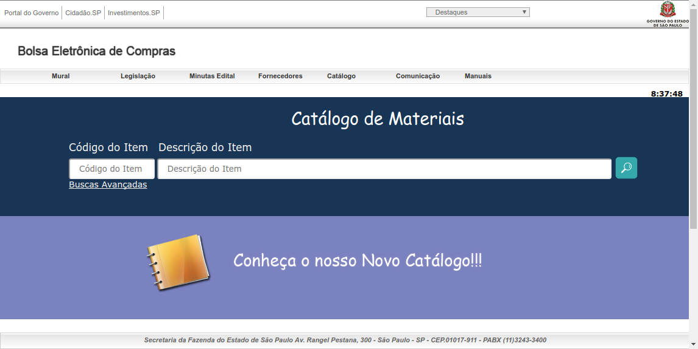
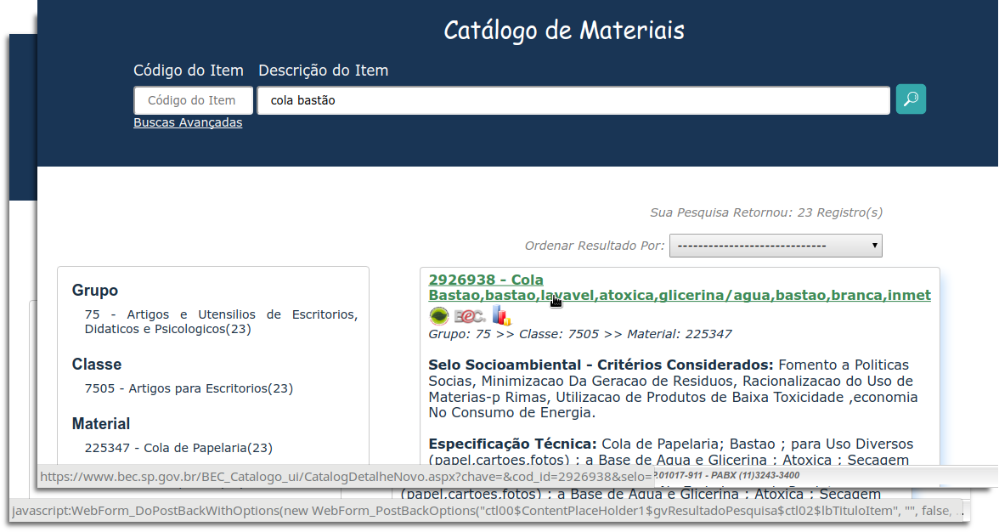

# BecLink

Web Extension para tratamento de links dos resultados das buscas no Catálogo de Materiais da [Bolsa Eletrônica de Compras do Governo do Estado de Sâo Paulo](https://www.bec.sp.gov.br).

O tratamento consiste em alterar o atributo `href=` das tags HTML `<a />`, trocando a chamada javascript pela devida referência à pagina de cada material no resultado da pesquisa. Essa alteração auxilia na abertura do link em janelas ou abas diferentes.

